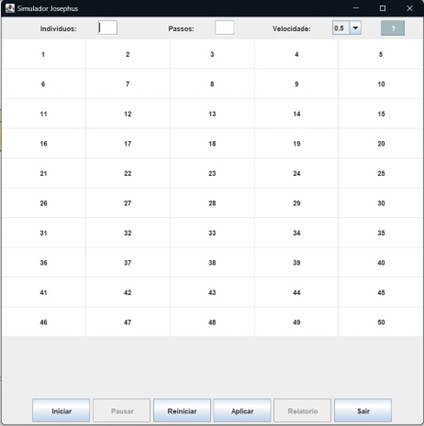
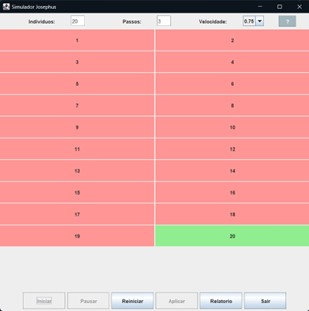

# JOSEPHUS GAME (Java)

## Description 
Group project that consisted of creating a Josephus Simulator using Java.
The project was developed using JPane and the BlueJ IDE.
The purpose of this simulator is to provide an interactive understanding of the Josephus problem using dynamic data structures.

## Interface
The program’s graphical interface is designed to be simple and intuitive. The user enters the number of participants in the text field and clicks the button to start the simulation. The results are displayed in a text area, clearly showing which participants were eliminated and who the final survivor is.

  
    
Main interface.

### Interactive Spaces:
#### Indivíduos (Individuals)
- A field where the user can input the number of participants in the simulation
#### Passos (Steps)
- A field to define the number of steps between eliminations in the simulation process.
#### Velocidade (Speed)
- A dropdown menu that allows the user to adjust the simulation speed.

  
    
Interactive spaces.

### Program Controls:
At the bottom of the interface, you’ll find buttons that offer the following functionalities:
#### Iniciar (Start)
- Initiates the simulation with the defined settings.
#### Pausar (Pause)
- Temporarily stops the simulation.
#### Reiniciar (Restart)
- Resets the simulation from the beginning.
#### Aplicar (Apply)
- Confirms the current settings and prepares the simulation to start.
#### Relatório (Report)
- Generates a report of the simulation results, showing the elimination order and the final survivor.

  
    
Program controls.

### Simulation Visualization:
The interface also includes a numerical grid representing the individuals in the simulation, organized in columns and rows. This layout makes it easy to visually track the elimination process. When an individual is eliminated, their color turns red, and the final survivor is highlighted in green.

  
    
Example of the end of a simulation.

## Technical Details
Highlighted packages include the following classes:

#### 1. app package:
- Aplicacao: Contains the main method responsible for initializing the program.
- GUI: Utilizes JFrame to create the graphical interface and also handles the main program logic.
#### 2. controller package:
- Armazenador: Contains a circular doubly linked list used to store individuals. It also manages the dynamic vector for storing deceased participants and provides methods for manipulating these structures.
- Controller: Includes methods for simulating the process and retrieving the dynamic vector used in the simulation.
#### 3. entities package:
- Utils: Verifies the type of input value (string) and determines whether it is an integer, floating-point, non-numeric, or empty.
- Pessoa: Represents an instance of an individual with a status of alive or deceased.
#### 4. listaLigada package:
- Contains the classes ListaDuplamenteLigada and VetDin, along with their interfaces, which implement the logic for the data structures.
#### 5. gui package:
- Includes the Saida class and ISaida interface for graphical output.

## Contributions
Kauã Cordeiro Cavalheiro

Luan Bonasorte Capella

Teacher Julio Arakaki

#### The project was coded using Java.
